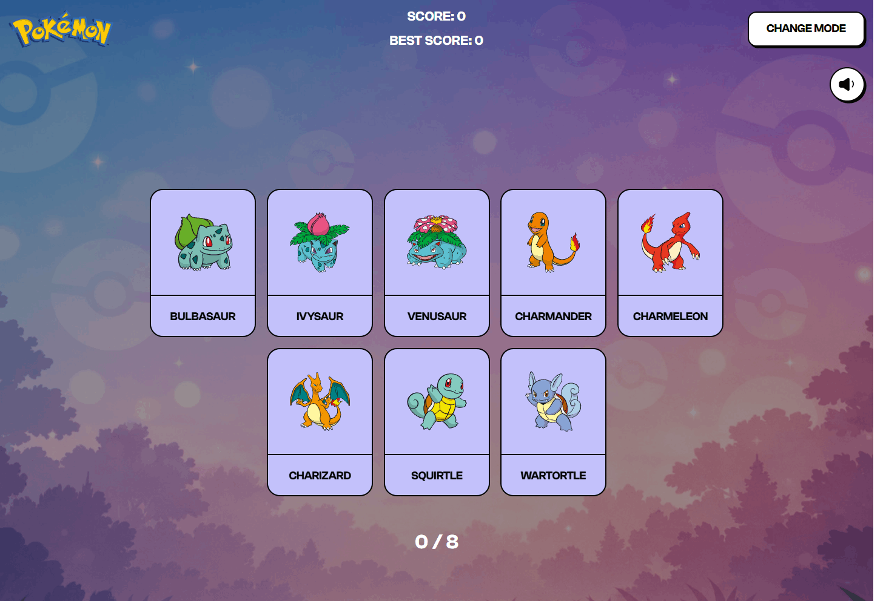

# Pokemon Memory Card Game

A React-based memory card game where players must click each Pokemon card only once to win.

[Live Demo](https://memory-card-game-dd.netlify.app/) | [Report Bug](https://github.com/dee-diaz/memory-card-game/issues)



## Features

- 3 difficulty levels (5, 8, or 12 cards)
- Card flip animations with 3D transforms
- Sound effects toggle
- Score tracking with best score
- Real Pokemon data from PokeAPI
- Fully responsive design

## Tech Stack

- React 18
- Tailwind CSS v4
- Vite
- PokeAPI

## Project Structure

```
src/
├── components/     # UI components
├── contexts/       # React contexts (sound, mode, game state)
└── index.css       # Global styles & Tailwind config
```
